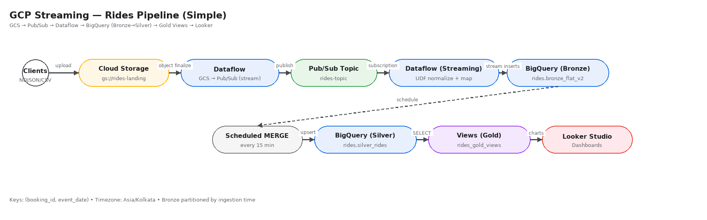

# Rides Streaming on Google Cloud (End-to-End)

**GCS → Pub/Sub → Dataflow → BigQuery (Bronze→Silver) → Gold Views → Looker Studio**  
Production baseline with **DLQ**, **DQ tripwires**, and **compact views** for fast dashboards.

> Replace `<PROJECT_ID>` and `<REGION>` in SQL files. Datasets: `rides`, `rides_gold_views`, `rides_ops`.

## Architecture

## Quick Install (UI)
1. **Create datasets** (region = `<REGION>`): `rides`, `rides_gold_views`, `rides_ops`.
2. **Dataflow**: 
   - *GCS → Pub/Sub (stream)* template (source bucket, topic `rides-topic`)
   - *Subscription → BigQuery* template with UDF `udf/normalize.js` → sink `rides.bronze_flat_v2`
3. **Silver MERGE**: schedule `bq/silver/merge_incremental.sql` every 15 min.
4. **Gold Views**: run `bq/views/*.sql`.
5. **DQ Tripwires**: schedule `bq/ops/dq_tripwires.sql` (dest `rides_ops.dq_status_latest`, Overwrite, email on failure).
6. **DLQ**: enable dead-letter on `rides-sub` to topic `rides-dlq`. Sink to `rides_ops.dlq_raw` via template.
7. **Looker**: connect to **latest/last30** views for snappy pages.

## Repo Layout
- `udf/` — JS UDF + Jest tests
- `bq/bronze/` — Bronze & Silver DDL
- `bq/silver/` — MERGE
- `bq/views/` — Base + compact gold + latest/last30
- `bq/ops/` — DQ tripwires + DLQ helper views
- `docs/` — Architecture diagrams & docs
- `.github/workflows/ci.yml` — Jest + sqlfluff

**Version:** v1.0.0 • 2025-08-17
